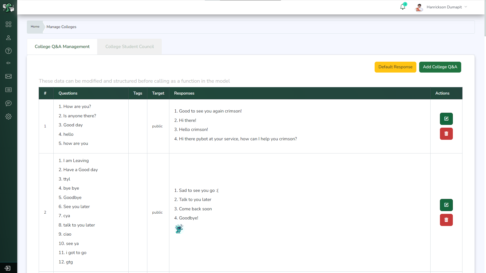

# PyBot - An AI Chatbot for College of Computing Studies

PyBot is an AI-powered chatbot designed to provide information assistance for the College of Computing Studies. It can answer inquiries from students, faculty, and unauthorized users by leveraging an extensive question and answer database curated by administrators.

### Features
  - Knowledge Base: Access a comprehensive bank of questions and answers managed by administrators through an intuitive web interface.
  - Intent Recognition: PyBot utilizes natural language processing to understand user queries and provide relevant responses from the knowledge base.
  - Profanity Filter: A profanity filter ensures that PyBot's responses remain appropriate and professional.
  - Chat Support: If PyBot's responses are unsatisfactory, users can initiate a chat session with support staff for further assistance.
  - User Management: Super administrators can grant and manage access roles for users within the system.
  - Model Management: Administrators can build and deploy updated chatbot models to incorporate the latest changes to the knowledge base.

PyBot is accessible through a user-friendly web interface at [Admin](http://www.pybot.online/), where users can ask questions and receive instant responses from the chatbot.

### Technologies Used
 
 PyBot is built using a combination of modern web technologies and frameworks:

   - Laravel: A robust PHP web application framework for building the backend and administrative interface.
   - Blade: Laravel's powerful templating engine for creating dynamic views.
   - CSS: Styling the user interface with cascading style sheets.
   - Livewire: A modern reactive framework for building dynamic user interfaces in Laravel.
   - Python: The core natural language processing and machine learning components are implemented using Python.
   - JavaScript: Enhancing the user experience with interactive client-side scripting.

## Installation

There are two options to set up this management system:

 > Download the ZIP

1. Click "Code" and select "Download ZIP" to download the files
2. Extract the ZIP file to your desired folder
3. Open the project in your preferred IDE (e.g., VS Code).
4. Set up the Laravel prerequisites by running the following commands:  
> `php artisan migrate fresh` 
> `php artisan db:seed`
> `composer update` then `composer require livewire/livewire`
5. Run the Python app from `files/python-3.6.7rc2-amd64.exe`
6. Set up Python by running these commands:
> c:\python_3.6\python.exe -m pip install --upgrade pip   (check out your environment variables path of python.exe) 
> pip install numpy, mltk, tensorflow, etc. or
> type command `pip list`
7. Host the files on your server and access the application through your domain or localhost.
8. Register as a sub-admin/student and wait for the Admin to confirm your entry to get started  

 > Fork the Repository 

1. Click "Fork" in the top right to fork this repo
2. Clone your forked repo to your local machine
3. Same procedure from the previous Step `3`-`6`.
4. Register as a sub-admin/student and wait for the Admin to confirm your entry to get started  

And that's it! From your admin dashboard you can explore and manage the entire system. Let us know if you have any other questions!

## Preview 
|  |  |
| --- | --- |
| Admin | Students |
